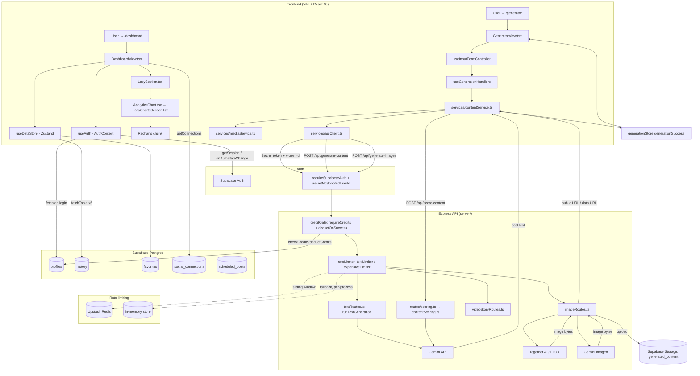

# Architecture Audit — generator-postow-ai (so-main)

> Read-only analysis. No code was changed as part of this audit.
> Generated: 2026-08-05

---

## 1. Stack i narzędzia

**Frontend**
- React 18.3.1 + TypeScript 5.8 (strict mode), Vite 6.2 (`vite.config.ts`)
- Routing: `react-router-dom` 6.25 (`createBrowserRouter`, nested routes, code-split with `React.lazy` via `utils/chunkReload.lazyWithRetry`)
- State: `zustand` 4.5.4 — three stores (`stores/uiStore.ts`, `stores/dataStore.ts`, `stores/generationStore.ts`), plus React Context for Auth/Theme/Notifications
- i18n: `i18next` + `react-i18next` + `i18next-browser-languagedetector`, locales in `locales/{en,pl}/translation.json`
- Styling: Tailwind CSS 3.4 (no component library — `components/ui/*` are **hand-rolled**, not shadcn/ui)
- Charts: `recharts` (lazy-loaded chunk, see §3)
- AI SDKs used client-side for type-only helpers: `@google/genai`, `@google/generative-ai`
- Auth/DB client: `@supabase/supabase-js` 2.44
- Error/observability: `@sentry/react`, `posthog-js`
- Testing: `vitest` (54 test files under `tests/`)

**Backend** (`server/`, separate `package.json`, deployed independently — Railway/Nixpacks, see `server/nixpacks.toml`)
- Express (Node), TypeScript, own `tsconfig.json`
- AI providers: Gemini (`@google/generative-ai`, `@google/genai`), Together AI (FLUX images, `server/lib/togetherClient.ts`)
- Payments: Stripe (`server/stripe.ts`)
- Rate limiting: `express-rate-limit` with **Upstash Redis** adaptive backend (`@upstash/ratelimit`, `@upstash/redis`) and in-memory fallback
- DB/Auth: Supabase (service-role key on server, anon key on client)
- Social publishing: `twitter-api-v2` + custom OAuth handlers for LinkedIn/Facebook/Instagram/TikTok (`server/socialPublishing.ts`, `server/lib/socialOAuthHandler.ts`)

**Deployment / infra**
- Frontend: Vercel (`vercel.json`, `api/[...path].ts` proxies `/api/*` to `BACKEND_URL`) and/or Netlify (`netlify.toml`) — **two hosting configs present simultaneously**
- Backend: Railway (`railway.toml`) or Docker (`Dockerfile`)
- DB migrations: Supabase CLI migrations in `supabase/migrations/` (2 files) — see §5/§6 for drift vs. root `DATABASE_*.sql` files

**Path aliases**: `@/*` → project root (both `vite.config.ts` resolve.alias and `tsconfig.json` paths), so `@/services/...` and `../services/...` are interchangeable — used inconsistently across the codebase.

**Actual top-level structure** (differs from the assumed `src/{components,lib,hooks,stores,types,app}` layout):

| Assumed (by request) | Actual on disk |
|---|---|
| `src/app` (routes) | `index.tsx` (router) + `App.tsx` (shell/layout) at repo root |
| `src/components` | `components/` at repo root (302 items); `src/components/` only has `ui/LazySection.tsx` and `charts/LazyChartsSection.tsx` |
| `src/lib` | `services/` (81 files, client) + `server/lib/` (31 files, backend) |
| `src/hooks` | `hooks/` at repo root |
| `src/stores` | `stores/` at repo root |
| `src/types` | single `types.ts` file (17k) at repo root + `types/socialPublishing.ts` |

---

## 2. Przepływ danych

### 2.1 `/dashboard` — krok po kroku

1. `index.tsx` renders `RouterProvider`; `/dashboard` is nested under `ProtectedRoute` (`App.tsx`), which redirects to `/` if `useAuth().user` is null.
2. `AuthContext` (`contexts/AuthContext.tsx`) has already run on app boot: it wakes the Supabase project (`wakeUpSupabase`), fetches `supabase.auth.getSession()`, then `fetchAndSetUserData()` — fetches `profiles` row, builds a `User` object, and **fires off ~9 parallel non-blocking Supabase queries** (`history`, `favorites`, `templates`, `drafts`, `scheduled_posts`, `brand_voice_profiles`, `strategic_audits`, `calendar_plans`, `learned_insights`) that populate `useDataStore` incrementally.
3. `DashboardView.tsx` (lazy-loaded chunk) mounts. It reads from `useDataStore`, `useAuth`, and calls its own effects to load: streak data (`services/streakService`), social connections (`socialConnectionsService.getConnections`), strategic ideas (`services/geminiService.getStrategicContentIdeas`), niche/industry config from `localStorage` (`utils/userNiche`, `utils/userIndustries`).
4. Sub-panels fetch independently on mount: `WeeklySummary`, `EngagementInboxPanel` (→ `engagementInboxService` → backend `/api/social/comments` or similar), `ApprovalQueuePanel`, `RssToPostPanel`, `ProductToPostPanel`, `BrandMemoryQuickCard`.
5. `LazySection` (`src/components/ui/LazySection.tsx`) wraps below-the-fold dashboard content using `react-intersection-observer` to defer rendering/mounting until scrolled into view.

### 2.2 "Generuj post" — pełny flow

`GeneratorView.tsx` → `hooks/useInputFormController.ts` (558 lines, the central controller) → on submit calls into `hooks/appHandlers/useGenerationHandlers.ts` (largest handler file, 27KB) → `services/contentService.ts` (client orchestration) →:
- `services/apiClient.ts` (`callApi`/`generateContent`/`generateJson`) resolves base URL (`resolveApiBaseUrl`) and attaches Supabase JWT (`getApiAuthHeaders`) + `x-user-id` header
- Request hits Express: local dev via Vite proxy (`/api` → `localhost:3001`), production via Vercel `api/[...path].ts` serverless proxy → `BACKEND_URL` (Railway), or direct `VITE_API_BASE_URL`
- `server/app.ts` → `createGenerationRouter()` (`server/routes/generation/index.ts` → `textRoutes.ts` / `imageRoutes.ts` / `videoStoryRoutes.ts`)
- Route middleware chain: `textLimiter`/`expensiveLimiter` (rate limit) → `creditGate(...)` = `[requireSupabaseAuth, assertNoSpoofedUserId, requireCredits, deductOnSuccess]` (`server/middleware/credits.ts`) → `validateRequest(schema)` (Zod, `server/middleware/validate.ts`)
- Text: `runTextGeneration` (`generation/helpers.ts`) calls Gemini via `server/lib/clients.ts` (`genAI`), with retry/backoff (`server/lib/retry.ts`), anti-slop system prompt (`prompts/plAntiSlop.ts`), model fallback list, Langfuse tracing (`server/lib/langfuse.ts`)
- Image: `imageRoutes.ts` picks provider — `together` (FLUX, `server/lib/togetherClient.ts`) or `imagen` (Gemini), uploads result to Supabase Storage bucket `generated_content`, returns public URL or data URL
- On success, credits are deducted (`deductOnSuccess` wraps `res.json`, injects `X-Credits-Remaining` header + `creditsRemaining` field) and cost is logged (`server/costTracking.ts`, `server/logger.ts`)
- Response flows back to `contentService.ts`, which may run a **quality gate** (`scorePostContent` → `services/contentScoringService.ts` → `/api/score-content` → `server/contentScoring.ts` Gemini call) and optionally auto-retries/rewrites low-scoring content
- `useGenerationStore` (`generationSuccess`) stores the `GenerationResult`; `GeneratorView`/`ResultCard` re-render from the store

### 2.3 State ownership

| Layer | What lives there |
|---|---|
| **React Context** | `AuthContext` (user/session/plan/credits), `ThemeContext` (dark mode), `NotificationsContext` |
| **Zustand — `uiStore`** | Modal open/close flags, global UI toggles (not persisted) |
| **Zustand — `dataStore`** | History, favorites, templates, drafts, scheduled posts, brand voice profiles, strategic audit, calendar plan, learned insights — hydrated from Supabase on login |
| **Zustand — `generationStore`** | In-flight generation result/loading/error, streaming chunks, repurposing, sentiment/SEO analysis, hashtag/audio suggestions, video story progress — **persisted** via `persist`/`createJSONStorage` (i.e., partially backed by `localStorage`) |
| **localStorage** | Zustand persisted slices, onboarding flags (`utils/onboarding.ts`), niche/industry selection (`utils/userNiche.ts`, `utils/userIndustries.ts`), auto-publish prefs (`utils/autoPublishPrefs.ts`) |
| **Postgres (Supabase)** | Canonical data: profiles/credits, history, favorites, templates, drafts, scheduled/published posts, social connections, brand voice, teams, subscriptions/costs (see §5) |
| **Server memory / Upstash Redis** | Rate-limit counters (sliding window in Upstash when configured, else in-process `express-rate-limit` store — **not shared across server instances** if Upstash is absent) |

### 2.4 Auth

Supabase Auth (email/password + Google OAuth), **not** custom JWT: `contexts/AuthContext.tsx` uses `supabase.auth.getSession()` / `onAuthStateChange` client-side. The Supabase access token is forwarded as a `Bearer` header on every API call (`apiClient.getApiAuthHeaders`); the backend independently verifies it via `supabase.auth.getUser(token)` in `server/middleware/supabaseAuth.ts` (`requireSupabaseAuth`). An `x-user-id` header is also sent and cross-checked against the verified token (`assertNoSpoofedUserId`) to prevent user-id spoofing. Admin checks use an env allowlist (`ADMIN_USER_IDS`/`ADMIN_EMAILS`) or `app_metadata` (`isAdminUser`).

---

## 3. Kluczowe komponenty i ich odpowiedzialności

| Component | Responsibility | Data sources |
|---|---|---|
| `App.tsx` | Root shell: header/footer, protected-route logic, global modals wiring, Stripe checkout return handling, onboarding trigger, keyboard shortcuts, video-story generation handler | `useAuth`, `useUIStore`, `useAppHandlers`, `socialConnectionsService` |
| `index.tsx` | Router definition (`createBrowserRouter`), lazy chunk registration, provider tree (i18n/theme/auth/notifications), Supabase init, service worker registration | — |
| `components/DashboardView.tsx` (978 lines) | Home dashboard: stats cards, streak, social-account status widget, RSS/Product-to-post panels, approval queue, engagement inbox, industry-pack picker, onboarding checklist, trial banner, referral card | `useDataStore`, `useAuth`, `socialConnectionsService`, `streakService`, `geminiService` (strategic ideas), several `utils/*Niche/Industries` helpers |
| `components/GeneratorView.tsx` | Main content-generation UI (form + result), delegates almost all logic to `useInputFormController` | `useInputFormController`, `useGenerationStore` |
| `hooks/useInputFormController.ts` (558 lines) | Form state, validation, duplicate-content check, brand-voice merge, calendar prefill, submit orchestration | `useGenerationStore`, `useDataStore`, `useAppHandlers`, `contentDuplicateService` |
| `hooks/appHandlers/useGenerationHandlers.ts` (27KB, largest handler) | Actual generate/regenerate/repurpose/analyze/predict logic bridging UI to `services/contentService.ts` etc. | many services |
| `src/components/ui/LazySection.tsx` | Generic viewport-based lazy-mount wrapper (`react-intersection-observer`) — used 3× in `DashboardView.tsx` for below-the-fold sections | — |
| `src/components/charts/LazyChartsSection.tsx` | `React.lazy`-loaded Recharts wrapper, re-exported through `components/AnalyticsChart.tsx` so chart/`recharts` code splits into its own bundle (`recharts` manual chunk in `vite.config.ts`) | props only |
| `components/ui/*` | **Custom** design system: `ModernButton`, `ModernCard`, `ModernInput`, `ConfirmDialog`, `SkeletonLoader`, `Toast`, `LoadingStates`, `CreativeCanvas` (38KB — image/canvas editor) — **not shadcn/ui**, no Radix primitives |
| `components/EngagementInboxPanel.tsx`, `RssToPostPanel.tsx`, `ApprovalQueuePanel.tsx`, `WeeklySummary.tsx` | Dashboard sub-panels, each self-contained with own loading/error state and i18n | respective `services/*Service.ts` |
| `contexts/AuthContext.tsx` (452 lines) | Session bootstrap, profile sync, credits/plan state, teams hydration, logout/cleanup | Supabase Auth + `profiles` table + several tables via `fetchTable` helper |

Shared primitives: `Button`/`Card`/`Modal`/`Input` equivalents are `ModernButton.tsx`, `ModernCard.tsx`, `ModernInput.tsx`/`SecureInput.tsx`, and per-feature modals (`FeaturePanelModal.tsx`, `ConfirmDialog.tsx`) — all bespoke Tailwind components, no external UI kit dependency.

---

## 4. API Endpoints

Routes are mounted in `server/app.ts`. Auth column reflects the middleware actually applied in each router (`requireSupabaseAuth` / `creditGate` implies auth; unlisted = public or IP-rate-limited only).

| Method | Path | Auth? | Description |
|---|---|---|---|
| GET | `/health` | No | Health check |
| GET | `/` | No | API root/info |
| POST | `/api/payments/webhook` | No (Stripe sig verified) | Stripe webhook (raw body, mounted before `express.json`) |
| GET/POST | `/api/payments/*` | Mixed | Pricing (public), checkout/portal/rollover-history (auth) |
| GET/POST | `/api/templates` | Auth | Custom prompt templates |
| GET/POST | `/api/social/*` | Auth | Connections, comments, best-times, post-mortem |
| GET/POST | `/api/brand-voice/*` | Auth | Brand voice profile CRUD/learn |
| POST | `/api/generate-content`, `/generate-content-stream`, `/generate-json`, `/generate-batch` | Auth + credits (`textLimiter`/`expensiveLimiter`) | Text generation (`generation/textRoutes.ts`) |
| POST | `/api/generate-images` | Auth + credits (`expensiveLimiter`) | Image generation, Together/Imagen (`generation/imageRoutes.ts`) |
| POST | `/api/generate-video-story` | Auth + credits | Video story generation (`generation/videoStoryRoutes.ts`) |
| POST | `/api/optimize-multi-platform` | Auth | Multi-platform variant generation |
| GET | `/api/costs/*` | Auth (admin for some) | Cost tracking/reporting (`routes/costs.ts`) |
| POST | `/api/score-content`, `/benchmark-content` | Auth | Content quality scoring (`routes/scoring.ts` → `server/contentScoring.ts`) |
| POST | `/api/content/fetch-url` | Auth | RSS/URL content fetch for repurposing (`routes/contentFetch.ts`) |
| POST | `/api/brand-memory/*` | Auth | Brand long-term memory ingest/retrieve |
| POST | `/api/intelligence/*` | Auth | News/trends/competitor/schedule-gap AI analysis (`routes/intelligence.ts`, 18.8KB) |
| POST/GET | `/api/video/*` | Auth + credits | Video job status/polling |
| GET/POST | `/api/email/*` | Mixed (transactional triggers auth, `unsubscribe`/`preferences` token-based) | Email queue/status/lifecycle emails |
| GET/POST | `/api/referral/*` | Auth | Referral program |
| GET/POST | `/api/teams/*` | Auth | Team management/invites |
| GET/POST | `/api/evergreen/*` | Auth | Evergreen content recycling |
| GET | `/api/rate-limit-status` | Auth | Client-visible rate-limit status |

Rate limiting: `generalLimiter` applied globally (100/15min per user-or-IP); `expensiveLimiter` (20/hr) on image/video; `textLimiter` (50/5min) and `streamLimiter` (20/5min) on text endpoints. Backed by Upstash Redis sliding-window when `UPSTASH_REDIS_REST_URL`/`TOKEN` are set, else falls back to in-memory `express-rate-limit` (per-process, resets on restart, **not multi-instance safe**).

AI proxying: server holds all provider API keys (Gemini, Together AI) — client never talks to Gemini/Together directly, only to the Express API, which is the correct security boundary.

---

## 5. Baza danych — tabele i relacje

**⚠️ Schema is defined in three non-reconciled places** (see §6, P0-1):
1. Root `DATABASE_SCHEMA_SUPABASE.sql` (+ 13 sibling `DATABASE_*.sql` files at repo root)
2. `server/db/legacy_sql/` (15 more `DATABASE_FIX_*`/`DATABASE_*` files)
3. `supabase/migrations/` (2 files: `20260101000000_complete_schema.sql`, `20260102000000_fixes_and_addons.sql`) — the only one that looks like a real, ordered Supabase CLI migration history

### Tables per root `DATABASE_SCHEMA_SUPABASE.sql` (used by app code — confirmed via `.from('profiles')` etc., 44 call sites)
- `profiles` (extends `auth.users`: name, avatar, plan, credits, usage jsonb, `current_team_id`)
- `social_connections` (`user_id → auth.users`, platform enum: linkedin/twitter/facebook/instagram)
- `published_posts` (`user_id`, `connection_id → social_connections`)
- `scheduled_posts` (`user_id`, `connection_id`)
- `history` (generation history, `user_id`)
- `favorites` (`user_id`)
- `templates` (`user_id`)
- `drafts` (`user_id`)
- `learned_insights` (`user_id`, AI long-term memory)
- `brand_voice_profiles` (`user_id`)
- `video_stories` (`user_id`, `post_id → history`)
- `analytics` (`user_id`, `published_post_id → published_posts`)
- `usage_tracking` (`user_id`)
- Plus (from other root `DATABASE_SCHEMA_*.sql`): payments/subscriptions, teams, brand-memory, evergreen, social-multi tables

### Tables per `supabase/migrations/20260101000000_complete_schema.sql`
- `public.user_profiles` (**different name from `profiles`**, RLS: own-row select/update policies)
- `public.api_costs`, `public.generated_content`, `public.rate_limits`

### Tables added in `20260102000000_fixes_and_addons.sql`
- `calendar_plans`, `strategic_audits`, `tracked_competitors`, `subscriptions`, `credit_usage`, `subscription_history`, `credit_purchases`, `usage_tracking` (**second definition**, conflicts with root schema's `usage_tracking`), `invoices`, `tier_limits`, `credit_costs`, `api_costs` (**second definition**), `email_queue`, `email_log`, `email_unsubscribe`, `trial_history`, `credit_rollover_log`, `referrals`, `abandoned_checkouts`, `social_posts`

### Relations (as declared)
- Nearly every table has `user_id UUID REFERENCES auth.users(id) ON DELETE CASCADE` — user-scoped multi-tenancy
- `published_posts`/`scheduled_posts.connection_id → social_connections.id ON DELETE SET NULL`
- `analytics.published_post_id → published_posts.id ON DELETE CASCADE`
- `video_stories.post_id → history.id ON DELETE SET NULL`

### RLS
- 53 `ENABLE ROW LEVEL SECURITY` / `CREATE POLICY` statements found across `supabase/migrations/*.sql`
- Root-level `DATABASE_*.sql` files were not exhaustively checked for RLS parity with the migrations — given the table-name drift (`profiles` vs `user_profiles`), **RLS policy coverage for the tables the app actually queries (`profiles`, `history`, `favorites`, etc.) cannot be confirmed from `supabase/migrations/` alone**; it likely lives only in the ad-hoc root/legacy SQL files, which are not tracked as ordered migrations.

---

## 6. Problemy architektoniczne

### P0 — Krytyczne

**P0-1: Rozjazd schematu bazy danych / brak jednego źródła prawdy**
27+ `.sql` files spread across repo root, `server/db/legacy_sql/`, and `supabase/migrations/`. The Supabase CLI migration history (`supabase/migrations/`) defines `public.user_profiles`, while **all application code** (`contexts/AuthContext.tsx`, 44 call sites total) queries `public.profiles`. Two different tables also both define `usage_tracking` and `api_costs`. This means either the CLI migrations were never actually applied to the live project (schema created ad-hoc via the root `.sql` files run manually), or the live DB has diverged from every file in the repo. Either way, **no file in the repo is a trustworthy source of truth for the live schema**, which is high risk for onboarding, disaster recovery, and RLS auditing.

**P0-2: Dwa równoległe systemy hostingu/proxy dla API**
`vercel.json` + `api/[...path].ts` (Vercel serverless proxy to `BACKEND_URL`) coexist with `netlify.toml` and `railway.toml`/`Dockerfile`. `services/apiClient.ts` has hostname-sniffing logic (`resolveApiBaseUrl`) to guess which environment it's in (localhost / `*.app.github.dev` / Vercel / direct). This is fragile — any new preview/hosting domain requires manual updates to `resolveApiBaseUrl`, and it's unclear which deployment target is actually current/production.

**P0-3: In-memory rate limiting fallback is not multi-instance safe**
When `UPSTASH_REDIS_REST_URL`/`TOKEN` are unset, `server/middleware/rateLimiter.ts` falls back to per-process `express-rate-limit`. If the backend runs >1 instance (Railway can autoscale), each instance has its own counter, silently multiplying the effective rate limit — a real cost/abuse risk for the `expensiveLimiter` (image/video generation).

### P1 — Ważne

**P1-1: Duplicated `ContentScore` type + scoring logic (client vs server)**
`server/contentScoring.ts` (`scoreContent`, Gemini-backed) and `services/contentScoringService.ts` (`scorePostContent`, calls the API) both declare an identical `ContentScore` interface independently. Additionally, `services/contentService.ts` bypasses the client duplicate and does `import type { ContentScore } from '../server/contentScoring'` — a **client module reaching into the `server/` directory**, which `tsconfig.json` explicitly `exclude`s from the frontend project. This works today only because it's `import type` (erased at build) but is a maintenance trap: editing one `ContentScore` silently desyncs the other, and the type-only cross-boundary import will break if `server/` is ever moved/removed from the monorepo or if `isolatedModules`/verbatim type import settings change.

**P1-2: "God" files / handlers doing too much**
- `components/DashboardView.tsx` — 978 lines, renders stat cards, streak widget, social status card, panel orchestration, and industry-pack picker logic all in one file.
- `hooks/appHandlers/useGenerationHandlers.ts` — 27KB, the single biggest handler, covering generate/regenerate/repurpose/predict/hashtags/audio in one hook.
- `services/socialMediaApiService.ts` — 29KB, `server/socialPublishing.ts` — 40KB — cross-platform publishing logic (LinkedIn/Twitter/FB/IG/TikTok) concentrated in single files.
- `services/contentService.ts` (590 lines) and `services/autoPublishService.ts` (486 lines) — already partially refactored this session (visual quality gate extracted), but both still mix prompt-building, scoring, and orchestration concerns.

**P1-3: SQL sprawl makes RLS/security review hard**
Beyond P0-1, the sheer number of one-off `DATABASE_FIX_*.sql` files (`server/db/legacy_sql/DATABASE_FIX_RLS.sql`, `DATABASE_FIX_STRIPE.sql`, `DATABASE_FIX_TIKTOK.sql`, etc.) suggests schema issues have historically been patched reactively rather than via reviewed migrations, increasing the chance of an untracked security-relevant `ALTER POLICY` being lost.

**P1-4: Dual API base-URL resolution paths**
`getApiBaseUrl()` vs `getLongRunningApiBaseUrl()` in `services/apiClient.ts` have overlapping-but-different fallback chains (env var precedence differs), used inconsistently by different services (e.g., video/multi-platform use "long running", most others don't) — easy to introduce a request that silently goes through the wrong proxy and hits a timeout.

### P2 — Drobne / porządkowe

**P2-1: Inconsistent import style** — some files use the `@/` alias, most use relative `../` imports; no lint rule enforcing one style (not confirmed from an eslint config in the provided file list — none was found at repo root).

**P2-2: `any` usage is low but not zero** — 27 occurrences across `services/`, `components/`, `server/routes` (heaviest in `server/routes/brandVoice.ts` with 5, `services/geminiOmniService.ts` with 4). Not a systemic problem, but worth a follow-up pass.

**P2-3: Two client-side Gemini SDKs** — both `@google/genai` and `@google/generative-ai` are dependencies of the **frontend** `package.json` even though the frontend should never call Gemini directly (all AI calls are proxied through Express per §4). Worth confirming these are used only for shared types/utilities and not bundled unnecessarily into the client chunk.

**P2-4: `components/ui/` naming implies a design-system library but is fully bespoke** — no issue functionally, just worth documenting so new contributors don't assume shadcn/Radix conventions apply.

---

## 7. Rekomendacje refactoru (kolejność priorytetowa)

1. **Konsolidacja schematu DB (P0-1)** — Wybrać jedno źródło prawdy (rekomendacja: `supabase/migrations/`, zarządzane przez Supabase CLI). Wygenerować migrację "reconciliation" z aktualnego stanu produkcyjnej bazy (`supabase db pull` lub ręczny dump), zmapować `profiles` → `user_profiles` (albo odwrotnie — cokolwiek faktycznie istnieje na produkcji), i usunąć/zarchiwizować wszystkie luźne pliki `DATABASE_*.sql` z roota i `server/db/legacy_sql/` po potwierdzeniu zgodności.
2. **Ujednolicić hosting/proxy (P0-2)** — Zdecydować: Vercel+Railway *albo* Netlify, nie oba jednocześnie. Usunąć nieużywaną konfigurację, uprościć `resolveApiBaseUrl`.
3. **Wymusić Upstash w produkcji (P0-3)** — Dodać walidację startową (fail-fast lub warning w logach), jeśli backend działa w trybie multi-instance bez `UPSTASH_REDIS_REST_URL` ustawionego.
4. **Scalić `ContentScore` (P1-1)** — Przenieść wspólny typ do `shared/` (już istnieje `shared/config/`), importowany zarówno przez `server/` jak i `services/`, usunąć cross-boundary `import type` z `server/contentScoring.ts` w kodzie klienckim.
5. **Rozbić duże pliki (P1-2)** — Zacząć od `hooks/appHandlers/useGenerationHandlers.ts` (podział wg akcji: generate / regenerate / repurpose / predict), potem `components/DashboardView.tsx` (wydzielić `SocialStatusCard`, `StatsGrid` jako osobne pliki — `StatCard` już jest lokalnym komponentem, warto wynieść).
6. **Ujednolicić `getApiBaseUrl` / `getLongRunningApiBaseUrl` (P1-4)** — jedna funkcja z jawnym parametrem `{ longRunning?: boolean }`.
7. **Porządki P2** — dodać ESLint regułę importu (`@/` vs relative), audyt `any`, potwierdzić czy `@google/genai`/`@google/generative-ai` w root `package.json` są rzeczywiście potrzebne po stronie klienta.

---

## 8. Diagram Mermaid — przepływ danych

